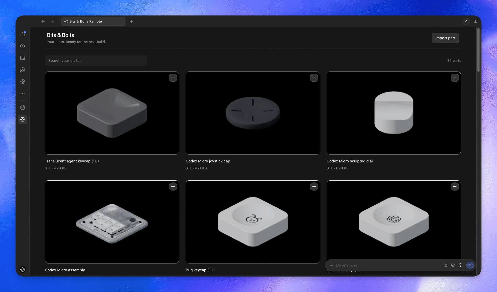

# OpenAI MCP Extensions

OpenAI MCP Extensions adds ChatGPT-specific capabilities to MCP so developers can build plugins that feel like native, first-class features.

## Showcase

### [Sidebar entrypoints](docs/spec.md#mcp-app-entrypoints)

Allow users to access your app from the sidebar.

### [File extension handlers](docs/spec.md#file-extension-entrypoint)

Render custom file viewers when users open a supported file type.

### [Composer mentions](docs/spec.md#composer-at-mentions)

Let users search your plugin’s resources from the composer and add references to a message.

### [Extended forms](docs/spec.md#openai-form-elicitation)

Let users select a CAD part using thumbnail choices.

## Try it out

Install the Bits & Bolts Remote plugin:

1. Install [Bits & Bolts Remote](https://chatgpt.com/plugins/plugin_asdk_app_6abadab6e7d881919e7491d52c7846e8).
2. Select the **Bits & Bolts** icon in the sidebar to open the **Parts Library**.

   

## Get started

### 1. Add the SDKs

- [TypeScript](typescript/README.md#installation): `@openai/mcp-extensions` for MCP servers and Apps.
- [Python](python/README.md#installation): `openai-mcp-extensions` for MCP servers.

### 2. Integrate extensions

Use [Plugin Creator](https://chatgpt.com/plugins/plugin_connector_1p_e1a10c53223481918a42f1510ec46c1e) and ask it about workflows you want in your plugin and how extensions can close those gaps.

### 3. Explore supported extensions

- [docs/spec.md](docs/spec.md) lists all supported extensions.
- [docs/patterns.md](docs/patterns.md) covers best practices.

### 4. Propose an extension

Help us help you build better extensions by [submitting an extension proposal](https://github.com/openai/mcp-extensions/issues/new?template=extension-proposal.md).

## License

This project is licensed under the [Apache License 2.0](LICENSE).
