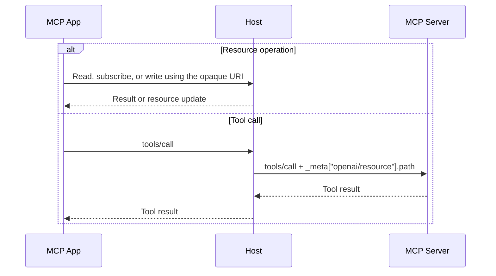

# OpenAI MCP Extensions Specification

For app design and compatibility guidance, see:

[patterns.md](patterns.md)

This specification defines extensions to [MCP](https://modelcontextprotocol.io/specification/2025-11-25/index) and [MCP Apps](https://github.com/modelcontextprotocol/ext-apps/blob/c55a3a231fb76303376e059aef9a13367e72731c/specification/draft/apps.mdx) for use across ChatGPT, including ChatGPT Work, ChatGPT Desktop, and ChatGPT mobile apps.

The MCP spec provides capabilities that work across MCP hosts. These extensions allow deeper integration into ChatGPT, enabling you to build richer features for your users than the standard MCP spec allows.

This spec outlines every extension and exactly how it builds on top of the existing MCP spec. In most cases, it is easier to use these extensions via our TypeScript and Python SDKs:

- [TypeScript SDK](../typescript/README.md) (MCP Servers and MCP Apps)
- [Python SDK](../python/README.md)

`MCP.<Type>` refers to the corresponding type in the [MCP schema reference](https://modelcontextprotocol.io/specification/2026-07-28/schema).

## Platform Support

This table describes expected support at DevDay launch. Web refers to the Work browser. Classic ChatGPT is excluded. Asterisks indicate platform limitations described in the corresponding sections.

| Feature                                             | Desktop   | Web                                              | iOS                                 | Android                             |
| --------------------------------------------------- | --------- | ------------------------------------------------ | ----------------------------------- | ----------------------------------- |
| [Global entrypoint](#global-entrypoint)             | Supported | Supported                                        | Supported                           | Supported                           |
| [Thread entrypoint](#thread-entrypoint)             | Supported | Supported                                        | Supported                           | Supported                           |
| [File entrypoint](#file-extension-entrypoint)       | Supported | Not supported                                    | Not supported                       | Not supported                       |
| [Structured settings](#structured-settings)         | Supported | Supported                                        | Supported                           | Supported                           |
| [Resource display modes](#display-modes)            | Supported | Supported                                        | Supported                           | Supported                           |
| [MCP App deep links](#deep-links)                   | Supported | Supported                                        | Supported                           | Not supported                       |
| [Richer message sending](#uimessage-extensions)     | Supported | Supported                                        | [Supported*](#uimessage-extensions) | [Supported*](#uimessage-extensions) |
| [Plugin onboarding](#plugin-onboarding)             | Supported | Supported                                        | Supported                           | Supported                           |
| [Richer model context](#uiupdate-model-context-extensions) | Supported | [Supported*](#uiupdate-model-context-extensions) | [Supported*](#thumbnails)           | Supported                           |
| [File opening](#opening-local-files)                | Supported | Not supported                                    | Not supported                       | Not supported                       |
| [File resources](#filesystem-access)                | Supported | Not supported                                    | Not supported                       | Not supported                       |
| [Composer at-mentions](#composer-at-mentions)       | Supported | Not supported                                    | Not supported                       | Not supported                       |
| [Richer forms](#openai-form-elicitation)           | Supported | [Supported*](#resource-selection)                | Not supported                       | Not supported                       |

## Server Capabilities

Servers advertise named capabilities at these locations:

| MCP Protocol version    | Result            | Capability location                                                   |
| ----------------------- | ----------------- | --------------------------------------------------------------------- |
| `2026-07-28` or newer   | `server/discover` | `capabilities["extensions"]`                                          |
| `2025-11-25` or earlier | `initialize`      | `capabilities["extensions"]` or legacy `capabilities["experimental"]` |

## MCP App Entrypoints

Normally, [MCP Apps](https://github.com/modelcontextprotocol/ext-apps/blob/c55a3a231fb76303376e059aef9a13367e72731c/specification/draft/apps.mdx) can only be invoked via the model. However, it may be convenient to allow users to open your MCP App via static entrypoints.

You can define up to three entrypoints on any MCP App:

- Global: Available in the primary sidebar navigation.
- Thread: Available as a content tab within a thread.
- File: File extension handler to render matching files referenced from any part of any thread.

### Behavior Details

- Entrypoints are registered by adding one or more entries to `_meta["openai/ui"]["entrypoints"]`, as defined below.
- `_meta["ui"]["visibility"]` normally controls model versus user visibility. This field is ignored when an MCP App is invoked as an entrypoint.

### Entrypoint Icons

An icon helps users identify the MCP Server in navigation.

Entrypoint icons are resolved in the following priority order:

1. The `icons` property in the MCP App’s `tools/list` entry.
2. The MCP Server icon for local MCP Servers, or the registered app logo for hosted MCP Apps. Server icons come from `_meta["io.modelcontextprotocol/serverInfo"]["icons"]` in `server/discover`, or `serverInfo["icons"]` in `initialize` for MCP Servers that do not implement `server/discover`.
3. A generic fallback icon.

### Titles

All entrypoints will be rendered with a title.

#### Behavior Details

- The title comes from the first defined property in the following list on your MCP App’s `tools/list` entry:
  - `title`
  - `annotations["title"]`
  - `name`

### Global Entrypoint

Global entrypoints expose apps that users can open fullscreen from global navigation.


#### Behavior Details

- The server MUST accept `{}` as the tool arguments when the entrypoint opens.
- On desktop, global entrypoints open with a composer and thread layout, with the app as a permanent tab. Requests that target the current thread, such as `ui/update-model-context` and `ui/message`, use that thread.

#### Schema

```ts
interface GlobalEntrypoint {
  type: "global";
}
```

#### Examples

`tools/list` response item:

```json
{
  "name": "cad.library",
  "inputSchema": {
    "type": "object"
  },
  "_meta": {
    "ui": {
      "resourceUri": "ui://bits-and-bolts/library"
    },
    "openai/ui": {
      "entrypoints": [
        {
          "type": "global"
        }
      ]
    }
  }
}
```

#### Deep Links

Deep links navigate directly to a particular page within a global entrypoint.

##### Behavior Details

- URI format:
  - `{scheme}://plugins/{pluginId}@{marketplace}/app/{toolName}?path={encodedAppRelativePath}`
    - `scheme`
      - `codex` on desktop. `chatgpt` on mobile.
    - `pluginId`
      - MUST be percent-encoded.
      - Can be found via the public ChatGPT plugin URL (`https://chatgpt.com/plugins/{pluginId}`).
    - `marketplace`
      - A custom `marketplace.json` `name`.
      - `@{marketplace}` MUST be omitted for plugins published directly to ChatGPT.
    - `toolName`
      - MUST be percent-encoded as a single path segment.
    - `encodedAppRelativePath`
      - The complete app-relative URL, including any query string, MUST be percent-encoded as the `path` query value.
      - The decoded app-relative URL MUST begin with `/` and MUST NOT contain a fragment.
      - If `path` is omitted, the app-relative URL defaults to `/`.
- MCP Apps receive the specified app-relative URL in `hostContext["openai/deepLink"]` during initialization and through subsequent `ui/notifications/host-context-changed` notifications, following [MCP Apps host-context update semantics](https://github.com/modelcontextprotocol/ext-apps/blob/c55a3a231fb76303376e059aef9a13367e72731c/specification/draft/apps.mdx#L1461-L1471).

Web link format:

```text
https://chatgpt.com/plugins/<plugin-id>/app/<tool-name>?path=<encoded-app-relative-url>
```

##### Schema

```ts
interface DeepLinkHostState {
  /** App-relative URL, including any query. */
  url: string;
}
```

##### Examples

Deep link with two query parameters:

```text
codex://plugins/bits-and-bolts/app/cad.library?path=%2Fparts%3Ftag%3Dbolt%26sort%3Dasc
```

MCP App `initialize` result:

```json
{
  "jsonrpc": "2.0",
  "id": 0,
  "result": {
    "protocolVersion": "2026-01-26",
    "hostInfo": { "name": "example-host", "version": "1.0.0" },
    "hostCapabilities": {},
    "hostContext": {
      "openai/deepLink": {
        "url": "/parts?tag=bolt&sort=asc"
      }
    }
  }
}
```

Notification when the user clicks a deep link to a different page:

```text
codex://plugins/bits-and-bolts/app/cad.library?path=%2Fparts%2Fhex-bolt
```

```json
{
  "jsonrpc": "2.0",
  "method": "ui/notifications/host-context-changed",
  "params": {
    "openai/deepLink": {
      "url": "/parts/hex-bolt"
    }
  }
}
```

### Thread Entrypoint

Thread entrypoints let users manually open an MCP App as a new content tab within a thread.


#### Behavior Details

- The server receives `{}` as the tool arguments when the entrypoint opens.
- Every thread will have a different instance of the entrypoint.

#### Schema

```ts
interface ThreadEntrypoint {
  type: "thread";
}
```

#### Examples

`tools/list` response item:

```json
{
  "name": "cad.tray",
  "inputSchema": {
    "type": "object",
    "properties": {}
  },
  "_meta": {
    "ui": {
      "resourceUri": "ui://bits-and-bolts/tray"
    },
    "openai/ui": {
      "entrypoints": [
        {
          "type": "thread"
        }
      ]
    }
  }
}
```

### File Extension Entrypoint

File extension entrypoints let MCP Apps advertise support for file types (for example, `.ipynb` or `.stl`) and provide a custom viewer in place of the default file viewer.

File extension entrypoints use extended MCP Resource APIs for reading, subscribing to, and updating the files that invoked them.


#### Capability Advertisement

MCP App `initialize` result:

```json
{
  "jsonrpc": "2.0",
  "id": 0,
  "result": {
    "protocolVersion": "2026-01-26",
    "hostInfo": { "name": "example-host", "version": "1.0.0" },
    "hostCapabilities": { "experimental": { "openai/resource": {} } },
    "hostContext": {}
  }
}
```

#### Behavior Details

- Servers MUST use the file-extension form (a string that starts with ".") of HTML's [`accept` attribute](https://html.spec.whatwg.org/multipage/input.html#attr-input-accept) for each value in `extensions`.
- The MCP Server tool receives `FileInput` as its arguments when the entrypoint opens.
  - `resourceUri`
    - Opaque URI that WILL NOT directly map to a filesystem path.
    - Standard [MCP resource methods](https://modelcontextprotocol.io/specification/2026-07-28/server/resources) such as `resources/read` and `resources/subscribe` work. However, they will be intercepted and handled by ChatGPT instead of the MCP Server.
- The MCP App receives `ui/notifications/tool-input` with the same `FileInput` arguments.

#### Schema

```ts
interface FileEntrypoint {
  type: "file";
  extensions: string[];
}

interface FileInput {
  file: {
    /** Non-empty name of the opened file. Includes the extension but not the path. */
    name: string;
    /** Non-blank opaque URI for access through the host. */
    resourceUri: string;
  };
}
```

#### Examples

`tools/list` response item:

```json
{
  "name": "cad.open",
  "inputSchema": {
    "type": "object",
    "properties": {
      "file": {
        "type": "object",
        "properties": {
          "name": {
            "type": "string"
          },
          "resourceUri": {
            "type": "string"
          }
        },
        "required": ["name", "resourceUri"]
      }
    },
    "required": ["file"]
  },
  "_meta": {
    "ui": {
      "resourceUri": "ui://bits-and-bolts/viewer"
    },
    "openai/ui": {
      "entrypoints": [
        {
          "type": "file",
          "extensions": [".stl", ".step"]
        }
      ]
    }
  }
}
```

Notification:

```json
{
  "jsonrpc": "2.0",
  "method": "ui/notifications/tool-input",
  "params": {
    "arguments": {
      "file": {
        "name": "hex-bolt.stl",
        "resourceUri": "host-resource://hex-bolt"
      }
    }
  }
}
```

#### Filesystem Access

Because MCP Apps can execute untrusted JavaScript, ChatGPT will never directly provide raw filesystem paths to MCP Apps. Instead, [MCP resource methods](https://modelcontextprotocol.io/specification/2026-07-28/server/resources) should be used.

For more advanced filesystem usage, such as reading relative files or parsing very large files that can't be transferred via a single MCP resource request, use dedicated tools handled by the MCP Server.

Tool calls from an MCP App to its MCP Server within a file extension entrypoint will be intercepted and amended with `_meta["openai/resource"]["path"]`. Its value is the absolute filesystem path of the opened resource.

Once the MCP Server has the path, it can do anything with it, including sending the path back to the MCP App if it is trusted.



#### `resources/read` Representation

By default, MCP Servers determine whether the right [representation](https://modelcontextprotocol.io/specification/2026-07-28/server/resources#resource-contents) for a resource is text or a base64-encoded blob. However, a `resources/read` call for a file extension entrypoint is handled by ChatGPT, which cannot infer what the correct representation should be. To specify the ideal representation, set `_meta["openai/resource"]["representation"]` to either `"text"` or `"blob"`.

##### Behavior Details

- If the representation is unspecified, an MCP App SHOULD be able to handle either text or blob results.
- If a representation is requested from a URI other than the one that represents the file extension entrypoint, it is up to the MCP Server to respect the representation request.

##### Examples

Request:

```json
{
  "jsonrpc": "2.0",
  "id": 1,
  "method": "resources/read",
  "params": {
    "uri": "host-resource://hex-bolt",
    "_meta": { "openai/resource": { "representation": "text" } }
  }
}
```

#### Resource Subscriptions

MCP Apps receive change notifications through `notifications/resources/updated`.

##### Behavior Details

- MCP Apps MAY subscribe to changes to their `resourceUri` with `resources/subscribe` and stop receiving updates with `resources/unsubscribe`.

#### Resource Writes

The MCP protocol normally only allows you to read resources and subscribe to changes to them. File extension entrypoints support updating the resource to enable rich editor experiences within ChatGPT via an `openai/resources/write` method.

##### Behavior Details

- MCP Apps MAY receive `_meta["openai/resource"]` on a content item in a `resources/read` result for a file opened via a file extension entrypoint.
- MCP Apps MAY call `openai/resources/write` with the `file["resourceUri"]` given to them via a file extension entrypoint.
- MCP Apps MAY NOT call `openai/resources/write` with any other URI.
- MCP Apps MAY NOT call `openai/resources/write` if `writable` was not set to true when reading the file.
- If `ifMatch` is provided, the resource will only be updated if the ETag provided matches the latest value.

##### Schema

```ts
/** `resources/read` `_meta["openai/resource"]` for a file extension entrypoint URI. */
interface ResourceMetadata {
  /** A hint as to whether the host supports writes. Defaults to false. */
  writable?: boolean;
  /** Opaque version token for the returned contents. */
  etag?: string;
}

/** `openai/resources/write` params. */
type ResourceWriteParams = {
  /** Non-blank host-provided URI of the opened resource. */
  uri: string;
  /** Non-empty ETag to match. Omit to write without a version check. */
  ifMatch?: string;
} & (
  | { text: string }
  | {
      /** Base64-encoded replacement contents. */
      blob: string;
    }
);

/** `openai/resources/write` result. */
type ResourceWriteResult =
  | {
      outcome: "saved";
      /** ETag of the saved version. */
      etag: string;
    }
  | {
      outcome: "conflict";
      /** Not saved. ETag of the current version. */
      etag: string;
    }
  | {
      outcome: "too-large";
      /** Not saved. Size limit exceeded by UTF-8 text or base64-decoded blob bytes. */
      maxBytes: number;
    };
```

##### Examples

`resources/read` response:

```json
{
  "jsonrpc": "2.0",
  "id": 1,
  "result": {
    "contents": [
      {
        "uri": "host-resource://hex-bolt",
        "text": "solid hex-bolt\nendsolid hex-bolt\n",
        "_meta": {
          "openai/resource": { "etag": "version-1", "writable": true }
        }
      }
    ]
  }
}
```

Request:

```json
{
  "jsonrpc": "2.0",
  "id": 2,
  "method": "openai/resources/write",
  "params": {
    "uri": "host-resource://hex-bolt",
    "text": "solid edited-hex-bolt\nendsolid edited-hex-bolt\n",
    "ifMatch": "version-1"
  }
}
```

Response:

```json
{
  "jsonrpc": "2.0",
  "id": 2,
  "result": { "outcome": "saved", "etag": "version-2" }
}
```

## Structured Settings

Structured settings let MCP Apps contribute settings to the plugin details page within ChatGPT. ChatGPT will render the settings with native controls that match the look and feel of ChatGPT on the current platform.


### Capability Advertisement

Servers advertise `openai/settings` through [server capabilities](#server-capabilities).

`initialize` result (MCP `2025-11-25`):

```json
{
  "jsonrpc": "2.0",
  "id": 1,
  "result": {
    "protocolVersion": "2025-11-25",
    "serverInfo": {
      "name": "bits-and-bolts",
      "version": "1.0.0"
    },
    "capabilities": {
      "tools": {},
      "experimental": {
        "openai/settings": {
          "readTool": "settings.read",
          "updateTool": "settings.update"
        }
      }
    }
  }
}
```

`server/discover` result:

```json
{
  "jsonrpc": "2.0",
  "id": 1,
  "result": {
    "resultType": "complete",
    "supportedVersions": ["2026-07-28"],
    "_meta": {
      "io.modelcontextprotocol/serverInfo": {
        "name": "bits-and-bolts",
        "version": "1.0.0"
      }
    },
    "capabilities": {
      "tools": {},
      "extensions": {
        "openai/settings": {
          "readTool": "settings.read",
          "updateTool": "settings.update"
        }
      }
    }
  }
}
```

### Behavior Details

- `SettingsCapability` returns two tools:
  - `readTool` reads the type-safe schema, current values, and layout for the settings.
  - `updateTool` receives updates for changed settings from ChatGPT.
- MCP Servers are responsible for persisting settings.

### Schema

```ts
/** capabilities["extensions"]["openai/settings"] */
interface SettingsCapability {
  /** Non-blank name of the read settings tool. */
  readTool: string;
  /** Non-blank name of the update settings tool. */
  updateTool: string;
}
```

### Read Settings Tool

Settings combine primitive fields and tool actions.

#### Behavior Details

- Servers MUST accept `{}` for the read tool, and calls to it must be read-only.
- `outputSchema`
  - Servers MUST declare an `outputSchema` describing `SettingsReadResult`.
  - The example response contains an `outputSchema` you can use.
- `values`
  - Servers MUST provide a current or default value in `values` for every schema property.
- `layout`
  - Servers MAY use `layout` to group settings and add tool actions into logical groupings.
  - Fields omitted from `layout` appear in an "Other settings" group after the listed groups.
- Primitive settings only support boolean, string (with optional enum), number, and integer types.
- Tool settings may correspond to MCP App tools or regular tools.
  - Tool actions use the referenced tool's display name: `title`, then `annotations.title`, then `name`.
  - Regular tools: when the button is clicked, ChatGPT will render a spinner followed by a tooltip containing text from the tool call response.
  - MCP App tools: when the button is clicked, ChatGPT will render the MCP App in a modal on top of settings. This can be used for bespoke settings such as a payment method entry form.

#### Schema

```ts
interface SettingsReadResult {
  schema: {
    type: "object";
    properties: Record<string, SettingSchema>;
    /** Required property names. All properties still need an effective value in `values`. */
    required?: string[];
  };
  /** Current or default values for every schema property. */
  values: Record<string, unknown>;
  /** Groups appear in array order. */
  layout?: SettingsGroup[];
}

type SettingSchema = {
  title: string;
  description?: string;
} & (
  | { type: "boolean" }
  | {
      type: "string";
      enum?: string[];
      /** Minimum string length. Nonnegative integer. */
      minLength?: number;
      /** Maximum string length. Nonnegative integer. */
      maxLength?: number;
      /** Regular expression that the value must match. */
      pattern?: string;
    }
  | {
      type: "number" | "integer";
      /** Inclusive lower bound. */
      minimum?: number;
      /** Inclusive upper bound. */
      maximum?: number;
      /** Positive number whose multiples are valid values. */
      multipleOf?: number;
    }
);

interface SettingsGroup {
  kind: "group";
  title: string;
  items: (
    | { kind: "property"; property: string }
    | {
        kind: "tool";
        /** Same-server tool accepting {}. */
        tool: string;
        /** @deprecated Set the title on the referenced MCP tool. Hosts ignore this field. */
        title?: string;
        description?: string;
      }
  )[];
}
```

#### Examples

Tool definition:

```json
{
  "name": "settings.read",
  "inputSchema": { "type": "object", "additionalProperties": false },
  "annotations": { "readOnlyHint": true },
  "outputSchema": {
    "type": "object",
    "properties": {
      "schema": { "type": "object" },
      "values": { "type": "object" },
      "layout": { "type": "array", "items": { "type": "object" } }
    },
    "required": ["schema", "values"]
  }
}
```

Response:

```json
{
  "jsonrpc": "2.0",
  "id": 1,
  "result": {
    "content": [],
    "structuredContent": {
      "schema": {
        "type": "object",
        "properties": {
          "units": {
            "type": "string",
            "title": "Measurement units",
            "enum": ["mm", "in"]
          },
          "showGrid": {
            "type": "boolean",
            "title": "Show grid"
          }
        }
      },
      "values": {
        "units": "in",
        "showGrid": false
      },
      "layout": [
        {
          "kind": "group",
          "title": "Display",
          "items": [
            {
              "kind": "property",
              "property": "units"
            },
            {
              "kind": "tool",
              "tool": "cad.library"
            }
          ]
        }
      ]
    }
  }
}
```

### Update Settings

The server receives updated settings values through the tool named by `updateTool` in the settings capability.

#### Behavior Details

- ChatGPT will only call `updateTool` with the settings properties that have changed.

#### Schema

```ts
interface SettingsUpdateArguments {
  set: Record<string, string | number | boolean>;
}
```

#### Examples

Tool definition:

```json
{
  "name": "settings.update",
  "inputSchema": {
    "type": "object",
    "properties": {
      "set": {
        "type": "object",
        "properties": {
          "units": { "type": "string", "enum": ["mm", "in"] },
          "showGrid": { "type": "boolean" }
        },
        "minProperties": 1,
        "additionalProperties": false
      }
    },
    "required": ["set"],
    "additionalProperties": false
  },
  "outputSchema": {
    "type": "object",
    "properties": { "values": { "type": "object" } },
    "required": ["values"]
  }
}
```

Request:

```json
{
  "jsonrpc": "2.0",
  "id": 1,
  "method": "tools/call",
  "params": {
    "name": "settings.update",
    "arguments": {
      "set": {
        "showGrid": true
      }
    }
  }
}
```

`tools/call` response retaining `units`:

```json
{
  "jsonrpc": "2.0",
  "id": 1,
  "result": {
    "content": [],
    "structuredContent": {
      "values": {
        "units": "in",
        "showGrid": true
      }
    }
  }
}
```

## Display Modes

The MCP Apps specification defines [display modes](https://github.com/modelcontextprotocol/ext-apps/blob/main/specification/2026-01-26/apps.mdx#display-modes) to specify where MCP Apps can be rendered.


[`appCapabilities.availableDisplayModes`](https://github.com/modelcontextprotocol/ext-apps/blob/main/specification/2026-01-26/apps.mdx#declaring-support) is available only after the app initializes, which can take time. Set `_meta["openai/ui"].availableDisplayModes` on the UI resource content item so ChatGPT can choose a supported mode immediately.

### Schema

```ts
type ChatGPTUIDisplayMode = "inline" | "fullscreen";

/** UI resource content item's `_meta["openai/ui"]`. */
interface DisplayModes {
  /** Display modes the app supports. */
  availableDisplayModes?: ChatGPTUIDisplayMode[];
  /** Preferred initial display mode. */
  preferredDisplayMode?: ChatGPTUIDisplayMode;
}
```

### Behavior Details

- ChatGPT supports `inline` and `fullscreen`, but not `pip`.
- When the model invokes an MCP App, ChatGPT considers `preferredDisplayMode` when choosing the initial display mode.
- If `availableDisplayModes` is omitted from `_meta["openai/ui"]`, ChatGPT assumes the app supports all ChatGPT display modes.
- If `availableDisplayModes` includes both `inline` and `fullscreen`, ChatGPT defaults to `fullscreen` unless `preferredDisplayMode` specifies otherwise.
- On Desktop, if `availableDisplayModes` is omitted, ChatGPT defaults to `inline` unless a supported `preferredDisplayMode` overrides it.
- ChatGPT uses `fullscreen` for all entrypoints.

### Examples

`resources/read` content item that opens fullscreen by default:

```json
{
  "uri": "ui://bits-and-bolts/library",
  "mimeType": "text/html;profile=mcp-app",
  "text": "<!doctype html><html>...</html>",
  "_meta": {
    "openai/ui": {
      "availableDisplayModes": ["inline", "fullscreen"]
    }
  }
}
```

## Plugin Onboarding

Onboarding provides a setup skill for users to run after installation. Setup invokes the onboarding skill in a new conversation, or in the existing thread if the plugin was installed during a conversation.


### Behavior Details

- Plugins MAY set `extensions["com.openai"]["onboardingSkill"]` in their manifest to a path relative to the plugin root, referencing a packaged skill.

### Examples

Manifest:

```json
{
  "name": "bits-and-bolts",
  "skills": "./skills/",
  "extensions": {
    "com.openai": {
      "onboardingSkill": "./skills/setup/SKILL.md"
    }
  }
}
```

## `ui/update-model-context` Extensions

This extension clarifies and extends the behavior of `ui/update-model-context`.


### Capability Advertisement

MCP App `initialize` result:

```json
{
  "jsonrpc": "2.0",
  "id": 0,
  "result": {
    "protocolVersion": "2026-01-26",
    "hostInfo": { "name": "example-host", "version": "1.0.0" },
    "hostCapabilities": {
      "experimental": { "openai/modelContext": {} },
      "updateModelContext": {
        "text": {},
        "image": {},
        "resourceLink": {},
        "resource": {},
        "structuredContent": {}
      }
    },
    "hostContext": {}
  }
}
```

### Behavior Details

- On web, image content in model context is not yet supported.
- On Desktop, visible context is grouped in one popover and removed together.
- Content block `_meta` is excluded from model input.
- `ui/update-model-context` is idempotent. Each call replaces the model context previously supplied by the same MCP App instance.

### Context Changed Notifications

Context change notifications provide updates from the host when model context changes, such as when a user removes an attachment.

#### Behavior Details

- MCP Apps receive their attached context in `hostContext["openai/modelContext"]` on initialization or remount.

#### Schema

```ts
type ModelContextHostState = {
  /** Non-empty ID, renewed any time content or structuredContent changes. */
  updateId: string;
  content?: MCP.ContentBlock[];
  structuredContent?: Record<string, unknown>;
} | null;
```

#### Examples

Request:

```json
{
  "jsonrpc": "2.0",
  "id": 1,
  "method": "ui/update-model-context",
  "params": {
    "content": [{ "type": "text", "text": "Selected: M6 hex bolt" }]
  }
}
```

Response:

```json
{
  "jsonrpc": "2.0",
  "id": 1,
  "result": {
    "_meta": {
      "openai/modelContext": {
        "updateId": "update-1"
      }
    }
  }
}
```

Notification (context cleared):

```json
{
  "jsonrpc": "2.0",
  "method": "ui/notifications/host-context-changed",
  "params": {
    "openai/modelContext": null
  }
}
```

### Titles

Titles provide human-readable labels for text attachments and alt text for images.

MCP Apps MAY set `_meta["openai/title"]` to a non-empty string on `text` and `image` content blocks.

#### Examples

Text block in `ui/update-model-context` with a title:

```json
{
  "type": "text",
  "text": "Selected: agent dial",
  "_meta": {
    "openai/title": "Agent dial"
  }
}
```

### Thumbnails

Thumbnails give text attachments a visual representation of their context.

MCP Apps MAY set `_meta["openai/thumbnail"]` to an `MCP.Icon` on `text` content blocks in `ui/update-model-context`.

#### Behavior Details

- `openai/thumbnail` is not yet supported on iOS.

#### Examples

Text block in `ui/update-model-context` with a thumbnail:

```json
{
  "type": "text",
  "text": "Selected: agent dial",
  "_meta": {
    "openai/thumbnail": {
      "src": "https://example.com/agent-dial.png"
    }
  }
}
```

### Background Context

Sometimes, it is useful to provide context to the model without showing a removable composer attachment to the user.

#### Behavior Details

- Content blocks marked with `annotations.audience: ["assistant"]` are hidden from the user.
  - All model context is sent to the model regardless of audience.
- MCP Apps returning serialized `structuredContent` in a text content block for [MCP backward compatibility](https://modelcontextprotocol.io/specification/2025-11-25/server/tools#structured-content) SHOULD set that block's `annotations.audience` to `["assistant"]`.

#### Examples

Request:

```json
{
  "type": "text",
  "text": "Current part: hex-bolt",
  "annotations": {
    "audience": ["assistant"]
  }
}
```

### Supported Content

`ui/update-model-context` and `ui/message` support the following content blocks:

| Content block     | Support       |
| ----------------- | ------------- |
| Text              | Supported     |
| Image             | Supported     |
| Resource link     | Supported     |
| Embedded resource | Supported     |
| Audio             | Not supported |

## `ui/message` Extensions

This extension adds metadata to [`ui/message`](https://github.com/modelcontextprotocol/ext-apps/blob/main/specification/2026-01-26/apps.mdx#mcp-apps-specific-messages) to control its behavior in ChatGPT.

### Capability Advertisement

Support for this extension is indicated by `"openai/message": {}`.

MCP App `initialize` result:

```json
{
  "jsonrpc": "2.0",
  "id": 0,
  "result": {
    "protocolVersion": "2026-01-26",
    "hostInfo": { "name": "example-host", "version": "1.0.0" },
    "hostCapabilities": {
      "experimental": { "openai/message": {} },
      "message": {
        "text": {}
      }
    },
    "hostContext": {}
  }
}
```

### Behavior Details

- `ui/message` supports the [same content types](#supported-content) as `ui/update-model-context`.
- On iOS, `ui/message` does not support resource links.

### Titles

Messages support the same [content titles](#titles-1) as model context.

Untitled text becomes ordinary message text, while titled text becomes a labeled inline item that can be removed as a single unit.

MCP Apps SHOULD NOT display titled text items as selected. Apps are not notified when an item is removed from the composer.

### Prompt Target and Send Behavior

This extension adds metadata to [`ui/message`](https://github.com/modelcontextprotocol/ext-apps/blob/main/specification/2026-01-26/apps.mdx#mcp-apps-specific-messages) to control its behavior in ChatGPT.

#### Behavior Details

- Defaults when undefined: `{ target: "active", send: true }`.
- On iOS and Android, only `{ target: "active", send: true }` is supported.
- On desktop and the Work browser, `send: false` MUST append content to the active draft or open a fresh editable draft when `target: "new"`, without submitting it.

#### Schema

```ts
interface MessageParams {
  role: "user";
  content: MCP.ContentBlock[];
  _meta?: {
    "openai/message"?: MessageOptions;
  };
}

type MessageOptions =
  | {
      /** Which conversation receives the content. */
      target: "new";
      /** Whether to send the content immediately. */
      send?: boolean;
    }
  | {
      target?: "active";
      send?: boolean;
    };
```

#### Examples

Request sending a message to a new conversation:

```json
{
  "jsonrpc": "2.0",
  "id": 1,
  "method": "ui/message",
  "params": {
    "role": "user",
    "content": [
      {
        "type": "text",
        "text": "Help me design a bracket."
      }
    ],
    "_meta": {
      "openai/message": {
        "target": "new"
      }
    }
  }
}
```

Request opening a new editable draft:

```json
{
  "jsonrpc": "2.0",
  "id": 2,
  "method": "ui/message",
  "params": {
    "role": "user",
    "content": [
      {
        "type": "text",
        "text": "Help me design a bracket."
      }
    ],
    "_meta": {
      "openai/message": {
        "target": "new",
        "send": false
      }
    }
  }
}
```

## Opening Local Files

Typically, an MCP App will not have access to raw filesystem paths. However, if its MCP Server provides an absolute filesystem path, it can request that ChatGPT open that file.

### Capability Advertisement

MCP Apps receive `hostCapabilities["experimental"]["openai/files"]: {}` in the `ui/initialize` result when opening local files is available.

MCP App `initialize` result:

```json
{
  "jsonrpc": "2.0",
  "id": 0,
  "result": {
    "protocolVersion": "2026-01-26",
    "hostInfo": { "name": "example-host", "version": "1.0.0" },
    "hostCapabilities": {
      "experimental": {
        "openai/files": {}
      }
    },
    "hostContext": {}
  }
}
```

### Schema

```ts
interface FileOpenParams {
  /** Absolute filesystem path on the execution host. */
  path: string;
}
```

### Examples

Request:

```json
{
  "jsonrpc": "2.0",
  "id": 1,
  "method": "openai/files/open",
  "params": {
    "path": "/workspace/parts/hex-bolt.stl"
  }
}
```

Response:

```json
{
  "jsonrpc": "2.0",
  "id": 1,
  "result": {}
}
```

## Composer At-Mentions

Normally, users can only at-mention a plugin or MCP Server. The at-mention capability allows your plugin to expose a searchable list of items (people, files, channels, etc.) that the user can mention individually in their prompt.


### Behavior Details

- The at-mention tool is responsible for handling the at-mention request, which includes a typeahead search query, and returning items for the user to choose from.
- Returned items may be resource links.
- Servers advertise `openai/mentions: { searchTool: string }` through [server capabilities](#server-capabilities). `searchTool` is the non-blank name of a read-only tool on that server.
- The tool named by `searchTool` MUST set `annotations.readOnlyHint` to `true`.
- At-mention tools MUST include `"app"` in `_meta["ui"]["visibility"]`.

> **Deprecated:** `_meta["openai/extensions"]["mentions/search"]: {}` remains supported when the `openai/mentions` capability is absent. Advertise the capability instead.

### Examples

Mention-search capability:

```json
{
  "extensions": {
    "openai/mentions": { "searchTool": "cad.mentions" }
  }
}
```

### Search Parameters

The at-mention tool accepts these arguments:

#### Schema

```ts
interface MentionSearchParams {
  /** Search text, which may be empty. */
  query: string;
}
interface MentionSearchResult {
  items: ResourceLink[];
}
```

#### Examples

Request:

```json
{
  "jsonrpc": "2.0",
  "id": 1,
  "method": "tools/call",
  "params": { "name": "cad.mentions", "arguments": { "query": "hex-bolt" } }
}
```

Response:

```json
{
  "jsonrpc": "2.0",
  "id": 1,
  "result": {
    "content": [],
    "structuredContent": {
      "items": [
        {
          "type": "resource_link",
          "uri": "cad://parts/hex-bolt",
          "name": "hex-bolt"
        }
      ]
    }
  }
}
```

## OpenAI Form Elicitation

Extended forms expand on [MCP form elicitation](https://modelcontextprotocol.io/specification/2026-07-28/client/elicitation#form-mode-elicitation-requests) with additional elicitation types and display modes.

**NOTE:** OpenAI-registered MCP servers require MCP `2026-07-28` or later with [multi-round-trip requests (MRTR)](https://modelcontextprotocol.io/specification/2026-07-28/basic/patterns/mrtr) for form elicitation. Direct MCP connections still support legacy forms.

### Capability Advertisement

MCP Host `initialize` request (MCP `2025-11-25`):

```json
{
  "jsonrpc": "2.0",
  "id": 1,
  "method": "initialize",
  "params": {
    "protocolVersion": "2025-11-25",
    "capabilities": {
      "extensions": {
        "openai/elicitation": {
          "form": {}
        }
      }
    },
    "clientInfo": { "name": "example-host", "version": "1.0.0" }
  }
}
```

### Behavior Details

- On connections that negotiate `2026-07-28` or later, MCP Servers SHOULD use [multi-round-trip elicitation](#multi-round-trip-elicitation).
- On connections that negotiate an earlier protocol version, MCP Servers MUST use `openai/elicitation/create`.
- `openai/elicitation/create` is a superset of `elicitation/create`.
- Forms containing unsupported input types are reported as unsupported. They are not partially displayed.

### Multi-Round-Trip Elicitation

This section extends [multi-round-trip requests](https://modelcontextprotocol.io/specification/2026-07-28/basic/patterns/mrtr) for form elicitation.

#### Behavior Details

- MCP Servers MUST require both `elicitation.form: {}` and `extensions["openai/elicitation"].form: {}` in the request's client capabilities.
- MCP Servers MUST specify an empty object `requestedSchema` in `elicitation/create` `inputRequests`:
  - `requestedSchema`: `{ "type": "object", "properties": {} }`.
- MCP Servers MUST put the `requestedSchema` in `_meta["openai/elicitation"]["requestedSchema"]`:
- Missing or unsupported schemas will be reported as unsupported without displaying the empty core form.

#### Examples

Multi round-trip `input_required` response (`2026-07-28` or later):

```json
{
  "jsonrpc": "2.0",
  "id": 1,
  "result": {
    "resultType": "input_required",
    "inputRequests": {
      "details": {
        "method": "elicitation/create",
        "params": {
          "mode": "form",
          "message": "Enter a project code",
          "requestedSchema": { "type": "object", "properties": {} },
          "_meta": {
            "openai/elicitation": {
              "requestedSchema": {
                "type": "object",
                "properties": {
                  "resource": {
                    "type": "string",
                    "format": "uri",
                    "x-openai-input": {
                      "type": "resource",
                      "options": [],
                      "userOptions": {}
                    }
                  }
                }
              }
            }
          }
        }
      }
    }
  }
}
```

### Legacy Elicitation Request

On legacy connections (`2025-11-25` or older), `openai/elicitation/create` is a drop-in replacement for `elicitation/create`.

#### Examples

Request:

```json
{
  "jsonrpc": "2.0",
  "id": 1,
  "method": "openai/elicitation/create",
  "params": {
    "mode": "form",
    "message": "Choose a CAD part to inspect",
    "requestedSchema": {
      "type": "object",
      "properties": {
        "resource": {
          "type": "string",
          "format": "uri",
          "x-openai-input": {
            "type": "resource",
            "options": [],
            "userOptions": {}
          }
        }
      }
    }
  }
}
```

Response:

```json
{
  "jsonrpc": "2.0",
  "id": 1,
  "result": {
    "action": "accept",
    "content": { "resource": "file:///parts/hex-bolt.stl" }
  }
}
```

### Extended String Schema

Servers MAY add `pattern` to MCP's [StringSchema](https://modelcontextprotocol.io/specification/2025-11-25/schema#stringschema).

#### Examples

Request:

```json
{
  "jsonrpc": "2.0",
  "id": 1,
  "method": "openai/elicitation/create",
  "params": {
    "mode": "form",
    "message": "Choose a CAD part to inspect",
    "requestedSchema": {
      "type": "object",
      "properties": {
        "part": {
          "type": "string",
          "title": "Reference file",
          "format": "uri",
          "pattern": "^(cad|file):"
        }
      }
    }
  }
}
```

### Option Descriptions

Titled `const` options support an optional `description`.

#### Examples

`part` field with supporting text for an option (`description`):

```json
{
  "type": "string",
  "oneOf": [
    {
      "const": "hex-bolt",
      "title": "M6 hex bolt",
      "description": "A fastener for the main joint."
    }
  ]
}
```

### Thumbnails

Thumbnails allow you to specify an image as the user-visible choice instead of just text.


#### Behavior Details

- Titled `const` options support an optional `x-openai-thumbnail: MCP.Icon`.
- Servers MUST use an HTTPS URL or base64-encoded image data URI for `src`.
- Thumbnails use MCP's [Icon](https://modelcontextprotocol.io/specification/2026-07-28/schema#icon) type.
- If ANY items for a given property have a thumbnail, ALL items for that property will be rendered with an image UI.
  - Items without a thumbnail will render a fallback image.

#### Examples

Request:

```json
{
  "jsonrpc": "2.0",
  "id": 1,
  "method": "openai/elicitation/create",
  "params": {
    "mode": "form",
    "message": "Choose a CAD part to inspect",
    "requestedSchema": {
      "type": "object",
      "properties": {
        "part": {
          "type": "string",
          "title": "Part",
          "oneOf": [
            {
              "const": "hex-bolt",
              "title": "M6 hex bolt",
              "x-openai-thumbnail": {
                "src": "https://example.com/hex-bolt.png"
              }
            },
            {
              "const": "washer",
              "title": "M6 washer",
              "x-openai-thumbnail": { "src": "https://example.com/washer.png" }
            }
          ]
        }
      }
    }
  }
}
```

### Suggested Values

Suggested values let users choose from predefined options or enter free-form text. Array fields support selecting multiple options and adding custom text. The same field constraints apply to suggested and entered values.


#### Behavior Details

- MCP Servers MAY add `x-openai-suggestions` to a string field or an array's string `items` schema. Each suggestion uses the same titled `const` option format as [option descriptions](#option-descriptions).

#### Examples

`part` field with a suggested value:

```json
{
  "type": "string",
  "minLength": 1,
  "x-openai-suggestions": [
    {
      "const": "hex-bolt",
      "title": "M6 hex bolt"
    }
  ]
}
```

`accessories` field with suggested values:

```json
{
  "type": "array",
  "items": {
    "type": "string",
    "x-openai-suggestions": [
      {
        "const": "washer",
        "title": "M6 washer"
      }
    ]
  }
}
```

Elicitation result with suggested and entered values:

```json
{
  "action": "accept",
  "content": {
    "accessories": ["washer", "custom-spacer", "custom-gasket"]
  }
}
```

### Resource Selection

Resource selection supports supplied resources, user-added files or directories, or both.


**Deprecated:** Use `type: "resource"` instead of `type: "file"`. The old value remains supported as an alias.

#### Behavior Details

- Servers declare resource inputs by adding an `x-openai-input` to a `string` (single-select) or `array` (multi-select) form field.
- Single-select fields submit a URI string.
- Multi-select fields submit an array of URI strings.
- On web, directory selection is unsupported.
- On web, forms requested through MCP Apps support only explicit resource selection without user uploads.
- Implicit selection always allows user uploads. When `userOptions` is omitted, it defaults to `{ kind: "file" }` with no file-type restrictions. Explicit selection shows no upload input when `userOptions` is omitted.
- Resource options may include a thumbnail (`_meta["openai/thumbnail"]: MCP.Icon`), a preview (`_meta["openai/preview"]: { target: PreviewTarget }`), or both.

##### Explicit vs Implicit Selection

| Mode         | Behavior                                                                                                                  |
| ------------ | ------------------------------------------------------------------------------------------------------------------------- |
| `"explicit"` | Items are chosen by selecting or deselecting them.                                                                        |
| `"implicit"` | Items are chosen by adding or removing them. All items that remain when the form is submitted are included in the result. |

- Selection modes apply only to multi-select (`type: array`) fields.
- Servers MUST NOT specify selection mode for single-selection fields.
- Servers MUST use only URIs from `options` for resource selection defaults.
- Servers MUST NOT specify `default` with `"implicit"` selection.

#### Schema

```ts
/** x-openai-input */
interface ResourceInput {
  type: "resource";
  /** Multi-select only. Defaults to "explicit". */
  selection?: "explicit" | "implicit";
  /** Server-provided entries. May be empty. */
  options: MCP.Resource[];
  /** Configures user-added resources. */
  userOptions?: UserResourceOptions;
}

interface UserResourceOptions {
  /** Defaults to "file". */
  kind?: "file" | "directory";
  /**
   * Allowed filename extensions or MIME types, including MIME wildcards.
   * https://html.spec.whatwg.org/multipage/input.html#attr-input-accept
   */
  accept?: string[];
}
```

#### Examples

Request (single selection):

```json
{
  "jsonrpc": "2.0",
  "id": 1,
  "method": "openai/elicitation/create",
  "params": {
    "mode": "form",
    "message": "Choose a CAD part to inspect",
    "requestedSchema": {
      "type": "object",
      "properties": {
        "part": {
          "type": "string",
          "title": "Reference file",
          "format": "uri",
          "x-openai-input": {
            "type": "resource",
            "options": [
              {
                "uri": "cad://parts/hex-bolt",
                "name": "hex-bolt",
                "title": "M6 hex bolt",
                "_meta": {
                  "openai/thumbnail": {
                    "src": "https://example.com/hex-bolt.png"
                  },
                  "openai/preview": {
                    "target": {
                      "type": "mcp_app_tool",
                      "name": "cad.open",
                      "arguments": {
                        "file": {
                          "name": "hex-bolt.stl",
                          "resourceUri": "cad://parts/hex-bolt"
                        }
                      }
                    }
                  }
                }
              },
              {
                "uri": "cad://parts/washer",
                "name": "washer",
                "title": "M6 washer"
              }
            ],
            "userOptions": { "kind": "file", "accept": [".stl", ".step"] }
          },
          "default": "cad://parts/hex-bolt"
        }
      }
    }
  }
}
```

Request (explicit selection):

```json
{
  "jsonrpc": "2.0",
  "id": 1,
  "method": "openai/elicitation/create",
  "params": {
    "mode": "form",
    "message": "Choose CAD parts to inspect",
    "requestedSchema": {
      "type": "object",
      "properties": {
        "parts": {
          "type": "array",
          "items": { "type": "string", "format": "uri" },
          "x-openai-input": {
            "type": "resource",
            "selection": "explicit",
            "options": [
              {
                "uri": "cad://parts/hex-bolt",
                "name": "hex-bolt",
                "title": "M6 hex bolt"
              },
              {
                "uri": "cad://parts/washer",
                "name": "washer",
                "title": "M6 washer"
              }
            ]
          },
          "default": ["cad://parts/hex-bolt"]
        }
      }
    }
  }
}
```

Request (implicit selection):

```json
{
  "jsonrpc": "2.0",
  "id": 1,
  "method": "openai/elicitation/create",
  "params": {
    "mode": "form",
    "message": "Choose CAD parts to inspect",
    "requestedSchema": {
      "type": "object",
      "properties": {
        "parts": {
          "type": "array",
          "items": { "type": "string", "format": "uri" },
          "x-openai-input": {
            "type": "resource",
            "selection": "implicit",
            "options": [
              {
                "uri": "cad://parts/hex-bolt",
                "name": "hex-bolt",
                "title": "M6 hex bolt"
              },
              {
                "uri": "cad://parts/washer",
                "name": "washer",
                "title": "M6 washer"
              }
            ]
          }
        }
      }
    }
  }
}
```

#### Previews

Previews open expanded details for resource options.

##### Behavior Details

- MCP Servers MAY add `_meta["openai/preview"]: { target: PreviewTarget }` to resource options, with or without a thumbnail.

##### Schema

```ts
// Opens on the originating server.
type PreviewTarget =
  | {
      type: "mcp_app_tool";
      // Non-blank name of the MCP App tool to call.
      name: string;
      // Defaults to {}.
      arguments?: Record<string, unknown>;
    }
  // Reads the linked MCP resource.
  | MCP.ResourceLink;
```

##### Examples

Resource option with a preview:

```json
{
  "uri": "cad://parts/hex-bolt",
  "name": "M6 hex bolt",
  "_meta": {
    "openai/preview": {
      "target": {
        "type": "resource_link",
        "uri": "cad://parts/hex-bolt",
        "name": "M6 hex bolt"
      }
    }
  }
}
```
