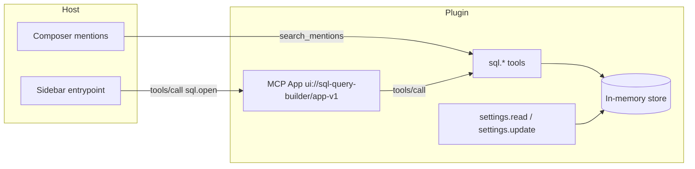
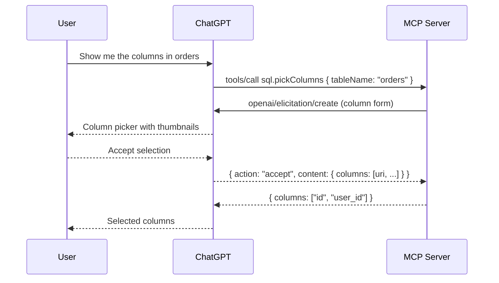

# SQL Query Builder

SQL Query Builder lets you browse database tables, pick columns with previews, and assemble SQL queries in the conversation. It is a compact example of the core MCP extensions available in ChatGPT.

The bundled demo database includes five tables across the `public` and `analytics` schemas, four saved queries, and a set of query preferences.

## Extensions

| Extension           | Where it's used                                                      |
| ------------------- | -------------------------------------------------------------------- |
| Sidebar entrypoint  | Open the query builder from the sidebar (`sql.open` quick action).   |
| Thread entrypoint   | Open the builder beside the conversation (`sql.tray`).               |
| Structured settings | Set default schema, max rows, result format, and timings natively.   |
| Form elicitation    | Pick a table, pick columns with thumbnails, and review a query form. |
| Resource reads      | Serve the query builder MCP app (`ui://sql-query-builder/app-v1`).   |
| Composer mentions   | Find tables by name or column from the composer.                     |
| Shared styles       | Match the host theme across the app.                                 |

## Build and package

Source builds require Node.js 22 or later, pnpm, and the MCP Extensions SDK. From the SDK repository root, install dependencies and build the SDK:

```sh
pnpm install --frozen-lockfile
pnpm build
```

From this example directory, build the server and app bundles:

```sh
node scripts/build.mjs
```

The output in `dist/` contains the stdio MCP server (`server.js`) and the MCP app (`app.js` and `app.html`). Hosts load the server through [`.mcp.json`](.mcp.json) and the plugin manifest in [`.codex-plugin/plugin.json`](.codex-plugin/plugin.json).

## Run

```sh
node ./dist/server.js
```

## How it works



The column picker runs a full form round trip:



## Usage examples

### Composer mentions

Request:

```json
{
  "jsonrpc": "2.0",
  "id": 1,
  "method": "tools/call",
  "params": { "name": "search_mentions", "arguments": { "query": "user_id" } }
}
```

Result:

```json
{
  "content": [],
  "structuredContent": {
    "items": [
      {
        "type": "resource_link",
        "uri": "sql://tables/orders",
        "name": "orders",
        "title": "orders",
        "mimeType": "text/plain"
      },
      {
        "type": "resource_link",
        "uri": "sql://tables/events",
        "name": "events",
        "title": "events",
        "mimeType": "text/plain"
      },
      {
        "type": "resource_link",
        "uri": "sql://tables/sessions",
        "name": "sessions",
        "title": "sessions",
        "mimeType": "text/plain"
      }
    ]
  }
}
```

### Column picker form

The server sends `openai/elicitation/create` with an `x-openai-input` resource field. Options carry a thumbnail in `_meta["openai/thumbnail"]` (data URIs are shortened here for brevity).

Request:

```json
{
  "jsonrpc": "2.0",
  "id": 1,
  "method": "openai/elicitation/create",
  "params": {
    "mode": "form",
    "message": "Select columns from orders",
    "requestedSchema": {
      "type": "object",
      "required": ["columns"],
      "properties": {
        "columns": {
          "type": "array",
          "title": "Columns",
          "items": { "type": "string", "format": "uri" },
          "x-openai-input": {
            "type": "resource",
            "selection": "explicit",
            "options": [
              {
                "name": "id",
                "title": "id",
                "uri": "sql://columns/orders/id",
                "_meta": {
                  "openai/thumbnail": {
                    "src": "data:image/svg+xml,...",
                    "mimeType": "image/svg+xml"
                  }
                }
              },
              {
                "name": "user_id",
                "title": "user_id",
                "uri": "sql://columns/orders/user_id",
                "_meta": {
                  "openai/thumbnail": {
                    "src": "data:image/svg+xml,...",
                    "mimeType": "image/svg+xml"
                  }
                }
              }
            ]
          }
        }
      }
    }
  }
}
```

Response:

```json
{
  "jsonrpc": "2.0",
  "id": 1,
  "result": {
    "action": "accept",
    "content": {
      "columns": ["sql://columns/orders/id", "sql://columns/orders/user_id"]
    }
  }
}
```

The `sql.pickColumns` tool maps the accepted URIs back to column names:

```json
{
  "content": [],
  "structuredContent": {
    "columns": ["id", "user_id"],
    "uris": ["sql://columns/orders/id", "sql://columns/orders/user_id"]
  }
}
```

### Structured settings

Request:

```json
{
  "jsonrpc": "2.0",
  "id": 1,
  "method": "tools/call",
  "params": { "name": "settings.read", "arguments": {} }
}
```

Result (the full result also includes `schema`, the JSON Schema for the values object):

```json
{
  "content": [],
  "structuredContent": {
    "layout": [
      {
        "kind": "group",
        "title": "Query defaults",
        "items": [
          { "kind": "property", "property": "defaultSchema" },
          { "kind": "property", "property": "maxRows" }
        ]
      }
    ],
    "values": {
      "defaultSchema": "public",
      "maxRows": 100,
      "format": "table",
      "showTimings": true
    }
  }
}
```

`settings.update` accepts a partial `set` object, merges it into the stored preferences, and returns the full `values`.

## Testing

The test suite bundles with esbuild and runs with the built-in Node test runner: store coverage plus an in-memory client/server round trip over tools, settings, mentions, and form elicitation.

```sh
pnpm --filter sql-query-builder test
```
